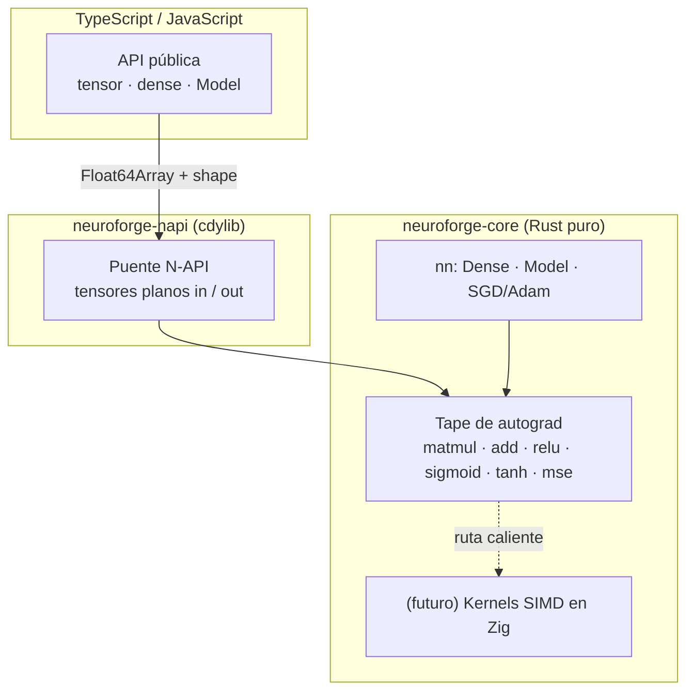

<div align="center">


**Framework de Deep Learning de alto rendimiento con núcleo en Rust, nativo del ecosistema Node.js.**

*Forja tus propias redes neuronales — sin Python, sin toolchain de C/C++, sin runtimes pesados.*

<br/>

[](https://www.npmjs.com/package/intellivium)
[](https://www.rust-lang.org/)
[](https://nodejs.org/)
[](https://napi.rs/)
[](#-licencia)

[English](./README.md) · **Español**

</div>

---

## Resumen

**Intellivium** *(antes NeuroForge)* es un framework de deep learning cuyo núcleo numérico está escrito enteramente en **Rust** y expuesto a JavaScript/TypeScript mediante **N-API**. El objetivo: la potencia de un motor ML nativo con la comodidad del ecosistema npm: `npm install`, importar y entrenar — con binarios precompilados por plataforma y **sin código C/C++, sin Python y sin VM embebida**.

Se inspira en PyTorch, TensorFlow y Flux.jl, pero toma una decisión de ingeniería deliberada: **un solo lenguaje nativo (Rust)** para el motor, **TypeScript** para el API público, y **Zig** reservado estrictamente para futuros kernels calientes.

> **¿Por qué no Julia / C++?** Julia se puede embeber, pero arrastra su runtime completo (VM + LLVM + stdlib, cientos de MB) más el calentamiento del JIT — inviable para distribuir por npm. C++ es innecesario: Rust da el mismo control de bajo nivel y SIMD sin el dolor de toolchains. Ver [Arquitectura](#arquitectura).

---

## ✨ Por qué Intellivium

| | |
|---|---|
| 🦀 **Núcleo en Rust** | Seguro en memoria, rápido, con un motor de autograd reverse-mode sobre *tape*, hecho desde cero. |
| 📦 **Nativo de Node** | Se distribuye como binarios N-API precompilados: `npm install` y listo, sin compilar nada. |
| 🧩 **Modular** | Separación limpia: motor (`neuroforge-core`) ↔ bindings (`neuroforge-napi`) ↔ API (`ts/`). |
| 🪶 **Cero deps pesadas** | Sin intérprete de Python, sin runtime de Julia, sin libtorch. Todo el motor es un solo addon nativo. |
| 🔓 **API TypeScript-first** | Superficie totalmente tipada y ergonómica, con sabor a JS moderno. |
| ⚙️ **Listo para Zig** | La arquitectura deja un hook limpio para kernels SIMD en Zig cuando el perfilado lo pida. |

---

## 🚦 Estado del proyecto

> **v0.3.0 · en npm.** El motor está probado y entrena modelos de verdad. Aún es pre-1.0, así que el API puede evolucionar — y la visión grande más abajo es un roadmap, no una afirmación actual.

**Disponible hoy** ✅
- Diferenciación automática reverse-mode (tape de Wengert, sin `Rc<RefCell>`).
- Operaciones: `matmul`, `add` con broadcast de bias, `relu`, `sigmoid`, `tanh`, `MSE`.
- Capas `Dense` (init He), `Model` secuencial, optimizadores **SGD y Adam**, losses **MSE y BCE**, **entrenamiento por mini-batches** y **`save`/`load`** de modelos.
- Bindings N-API + API TypeScript tipado.
- Validado de punta a punta en XOR (no lineal): **loss 0.247 → 0.0002**.

---

## 🚀 Inicio rápido

```bash
npm install intellivium
```

```ts
import { tensor, dense, Model } from "intellivium";

// XOR — la prueba no lineal clásica
const X = tensor([[0, 0], [0, 1], [1, 0], [1, 1]]);
const y = tensor([[0],    [1],    [1],    [0]]);

const model = new Model([
  dense(2, 8, "tanh"),
  dense(8, 1, "sigmoid"),
]);

const history = await model.train(X, y, {
  epochs: 1500,
  lr: 0.05,
  optimizer: "adam",
  loss: "bce",
});
console.log("loss final:", history.at(-1));

const pred = model.predict(X);
console.log(pred.toArray()); // ≈ [[0], [1], [1], [0]]
```

---

## Arquitectura

El grafo de autograd vive **enteramente en Rust**. Hacia JS solo cruzan tensores planos (`Float64Array` + shape) y operaciones de alto nivel — el grafo nunca se marshalea por operación.



**Estructura**

```
Intellivium/
├── crates/
│   ├── neuroforge-core/    # motor puro-Rust: autograd + nn  ← funciona hoy
│   │   ├── src/tape.rs     #   AD reverse-mode (el corazón)
│   │   ├── src/nn.rs       #   Dense, Model, train/predict
│   │   └── examples/xor.rs #   prueba con `cargo run`
│   └── neuroforge-napi/    # bindings N-API → .node
├── src/                     # API pública en TypeScript
└── examples/               # xor.mjs (Node)
```

---

## 🔧 Compilar desde el código

**Requisitos:** [Rust](https://rustup.rs/) (rustup), Node.js 18+, y `@napi-rs/cli` (ya está como dev dependency).

```bash
# 1. probar solo el motor Rust (sin Node)
cargo run --release -p neuroforge-core --example xor

# 2. compilar todo (.node nativo + TypeScript)
npm install
npm run build

# 3. correr el ejemplo en Node
npm test
```

---

## 🗺️ Roadmap y visión

El motor es la base. Todo lo de abajo es el plan a largo plazo, fase por fase — honesto sobre lo que **ya existe** frente a lo que falta.

**Leyenda:** ✅ Completo · 🟡 Parcial · 🔴 Planeado

### Fase 1 — Núcleo de Deep Learning · 🟡
*Un motor estable y confiable.*

**Tensores**
- [ ] Tipos de datos (sistema de dtypes — por ahora solo f32)
- [x] Broadcasting
- [x] Operaciones básicas
- [x] MatMul
- [x] Shape checking
- [ ] Tensor Views

**Autograd**
- [x] Reverse Mode
- [x] Wengert Tape
- [x] Gradientes
- [x] Grafo computacional
- [x] Liberación automática del grafo

**Redes neuronales**
- [x] Dense
- [x] Sequential
- [x] Inicialización He
- [x] ReLU
- [x] Sigmoid
- [x] Tanh

**Funciones de pérdida**
- [x] MSE
- [x] BCE
- [ ] Cross Entropy (categórica)

**Optimizadores**
- [x] SGD
- [x] Adam

**API**
- [x] TypeScript
- [x] NAPI
- [x] npm

### Fase 2 — Entrenamiento · 🟡
*Que entrenar un modelo sea cómodo.*

**Dataset**
- [ ] Dataset
- [ ] TensorDataset
- [ ] Custom Dataset

**DataLoader**
- [x] Mini Batch
- [x] Shuffle
- [ ] Batch Iterator

**Entrenamiento**
- [ ] Validation
- [ ] Early Stopping
- [ ] Checkpoints
- [ ] Gradient Clipping
- [ ] Learning Rate Scheduler

**Serialización**
- [x] save()
- [x] load()
- [ ] exportWeights()
- [ ] importWeights()

### Fase 3 — Biblioteca Neural · 🔴
*Agregar más bloques.*

**Layers**
- [ ] Dropout
- [ ] BatchNorm
- [ ] LayerNorm
- [ ] Embedding
- [ ] Flatten
- [ ] Reshape

**CNN**
- [ ] Conv1D
- [ ] Conv2D
- [ ] Conv3D

**Pooling**
- [ ] MaxPool
- [ ] AvgPool
- [ ] Global Pool

**Redes recurrentes**
- [ ] RNN
- [ ] LSTM
- [ ] GRU

### Fase 4 — Optimización del Motor · 🔴
*Antes de agregar IA moderna.*

**SIMD**
- [ ] Zig SIMD
- [ ] MatMul optimizado
- [ ] Conv optimizada

**Memoria**
- [ ] Arena Allocator
- [ ] Buffer Pool
- [ ] Zero Copy
- [ ] Tensor Pool

**Paralelismo**
- [ ] Rayon
- [ ] Multi Thread

**Benchmark**
- [ ] Benchmarks
- [ ] Profiler

### Fase 5 — Arquitecturas Modernas · 🔴
*Aquí recién aparecen los Transformers.*

**Attention**
- [ ] Self Attention
- [ ] Multi Head Attention
- [ ] Positional Encoding
- [ ] Rotary Embeddings

**Transformers**
- [ ] Encoder
- [ ] Decoder
- [ ] GPT
- [ ] BERT

**Vision**
- [ ] Vision Transformer
- [ ] ConvNeXt

### Fase 6 — Modelos Generativos · 🔴
- [ ] Autoencoder
- [ ] VAE
- [ ] GAN
- [ ] Diffusion

### Fase 7 — Reinforcement Learning · 🔴
- [ ] Replay Buffer
- [ ] DQN
- [ ] PPO
- [ ] SAC
- [ ] Actor Critic

### Fase 8 — ForgeLab · 🔴
*Computación científica.*

**Álgebra**
- [ ] LU
- [ ] QR
- [ ] SVD
- [ ] Eigen

**Numérico**
- [ ] Optimización
- [ ] ODE
- [ ] Root Finding

**Estadística**
- [ ] Monte Carlo
- [ ] Distribuciones

### Fase 9 — Hyper Data Engine (HDE) · 🔴

**Datos**
- [ ] Lazy Loading
- [ ] Streaming
- [ ] Hot Cache
- [ ] Dataset Cache

**Formatos**
- [ ] Parquet
- [ ] Arrow
- [ ] CSV
- [ ] JSON

**Engine**
- [ ] Memory Mapping
- [ ] Prefetch
- [ ] Columnar Storage

### Fase 10 — GPU · 🔴

**GPU**
- [ ] CUDA
- [ ] ROCm
- [ ] Metal
- [ ] Vulkan

**Mixed Precision**
- [ ] FP16
- [ ] BF16

**Quantization**
- [ ] INT8
- [ ] INT4

### Fase 11 — Producción · 🔴
- [ ] Inference Engine
- [ ] Batch Inference
- [ ] ONNX
- [ ] Serving
- [ ] HTTP
- [ ] gRPC

### Fase 12 — Ecosistema · 🔴
*Herramientas, no IA.*

**Visualización**
- [ ] Dashboard
- [ ] Tensor Inspector
- [ ] Training Graphs

**Extensiones**
- [ ] Plugins
- [ ] Custom Layers
- [ ] Custom Optimizers

**Model Hub**
- [ ] Modelos
- [ ] Datasets

### Fase 13 — Investigación · 🔴
*La visión más ambiciosa.*

**Distribuido**
- [ ] Multi GPU
- [ ] Multi Nodo

**Compilador**
- [ ] Graph Optimizer
- [ ] Kernel Fusion

**AutoML**
- [ ] NAS
- [ ] Hyperparameter Search

## 🤝 Contribuciones

Se aceptan issues, ideas y pull requests. Para cambios grandes, abre primero un issue para alinear la dirección. Por favor mantén el motor (`neuroforge-core`) libre de detalles de bindings/runtime — esa separación es intencional.

---

## ⚠️ Licencia

**[Apache License 2.0](./LICENSE).** Puedes usar, modificar y distribuir este software bajo los términos de la licencia Apache 2.0, que incluye una concesión de patentes. Copyright © 2026 Brashkie.

---

<div align="center">

⭐ **Si Intellivium te resulta útil, considera darle una estrella al repo.**

Hecho por [Brashkie](https://github.com/Brashkie)

</div>
