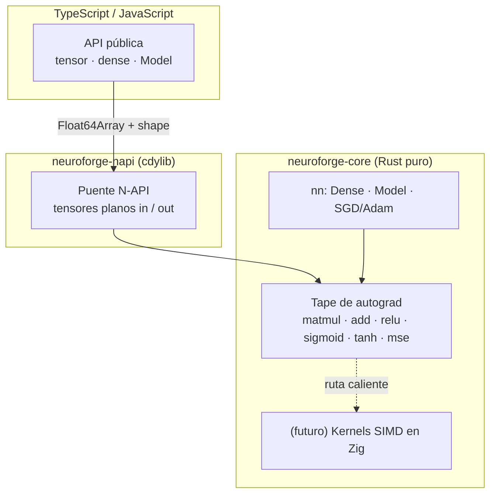

<div align="center">

# ⚡ Intellivium

**Framework de Deep Learning de alto rendimiento con núcleo en Rust, nativo del ecosistema Node.js.**

*Forja tus propias redes neuronales — sin Python, sin toolchain de C/C++, sin runtimes pesados.*

<br/>

[](https://www.npmjs.com/package/intellivium)
[](https://www.rust-lang.org/)
[](https://nodejs.org/)
[](https://napi.rs/)
[](#-licencia)

[English](./README.md) · **Español**

</div>

---

## Resumen

**Intellivium** es un framework de deep learning cuyo núcleo numérico está escrito enteramente en **Rust** y expuesto a JavaScript/TypeScript mediante **N-API**. El objetivo: la potencia de un motor ML nativo con la comodidad del ecosistema npm: `npm install`, importar y entrenar — con binarios precompilados por plataforma y **sin código C/C++, sin Python y sin VM embebida**.

Se inspira en PyTorch, TensorFlow y Flux.jl, pero toma una decisión de ingeniería deliberada: **un solo lenguaje nativo (Rust)** para el motor, **TypeScript** para el API público, y **Zig** reservado estrictamente para futuros kernels calientes.

> **¿Por qué no Julia / C++?** Julia se puede embeber, pero arrastra su runtime completo (VM + LLVM + stdlib, cientos de MB) más el calentamiento del JIT — inviable para distribuir por npm. C++ es innecesario: Rust da el mismo control de bajo nivel y SIMD sin el dolor de toolchains. Ver [Arquitectura](#arquitectura).

---

## ✨ Por qué Intellivium

| | |
|---|---|
| 🦀 **Núcleo en Rust** | Seguro en memoria, rápido, con un motor de autograd reverse-mode sobre *tape*, hecho desde cero. |
| 📦 **Nativo de Node** | Se distribuye como binarios N-API precompilados: `npm install` y listo, sin compilar nada. |
| 🧩 **Modular** | Separación limpia: motor (`neuroforge-core`) ↔ bindings (`neuroforge-napi`) ↔ API (`ts/`). |
| 🪶 **Cero deps pesadas** | Sin intérprete de Python, sin runtime de Julia, sin libtorch. Todo el motor es un solo addon nativo. |
| 🔓 **API TypeScript-first** | Superficie totalmente tipada y ergonómica, con sabor a JS moderno. |
| ⚙️ **Listo para Zig** | La arquitectura deja un hook limpio para kernels SIMD en Zig cuando el perfilado lo pida. |

---

## 🚦 Estado del proyecto

> **v0.2.0 · en npm.** El motor está probado y entrena modelos de verdad. Aún es pre-1.0, así que el API puede evolucionar — y la visión grande más abajo es un roadmap, no una afirmación actual.

**Disponible hoy** ✅
- Diferenciación automática reverse-mode (tape de Wengert, sin `Rc<RefCell>`).
- Operaciones: `matmul`, `add` con broadcast de bias, `relu`, `sigmoid`, `tanh`, `MSE`.
- Capas `Dense` con inicialización He, `Model` secuencial, optimizadores **SGD y Adam**, losses **MSE y BCE**.
- Bindings N-API + API TypeScript tipado.
- Validado de punta a punta en XOR (no lineal): **loss 0.247 → 0.0002**.

---

## 🚀 Inicio rápido

```bash
npm install intellivium
```

```ts
import { tensor, dense, Model } from "intellivium";

// XOR — la prueba no lineal clásica
const X = tensor([[0, 0], [0, 1], [1, 0], [1, 1]]);
const y = tensor([[0],    [1],    [1],    [0]]);

const model = new Model([
  dense(2, 8, "tanh"),
  dense(8, 1, "sigmoid"),
]);

const history = await model.train(X, y, {
  epochs: 1500,
  lr: 0.05,
  optimizer: "adam",
  loss: "bce",
});
console.log("loss final:", history.at(-1));

const pred = model.predict(X);
console.log(pred.toArray()); // ≈ [[0], [1], [1], [0]]
```

---

## Arquitectura

El grafo de autograd vive **enteramente en Rust**. Hacia JS solo cruzan tensores planos (`Float64Array` + shape) y operaciones de alto nivel — el grafo nunca se marshalea por operación.



**Estructura**

```
Intellivium/
├── crates/
│   ├── neuroforge-core/    # motor puro-Rust: autograd + nn  ← funciona hoy
│   │   ├── src/tape.rs     #   AD reverse-mode (el corazón)
│   │   ├── src/nn.rs       #   Dense, Model, train/predict
│   │   └── examples/xor.rs #   prueba con `cargo run`
│   └── neuroforge-napi/    # bindings N-API → .node
├── ts/                     # API pública en TypeScript
├── examples/               # xor.mjs (Node)
└── NEUROFORGE_BUILD.md      # decisión de stack + guía de build
```

---

## 🔧 Compilar desde el código

**Requisitos:** [Rust](https://rustup.rs/) (rustup), Node.js 18+, y `@napi-rs/cli` (ya está como dev dependency).

```bash
# 1. probar solo el motor Rust (sin Node)
cargo run --release -p neuroforge-core --example xor

# 2. compilar todo (.node nativo + TypeScript)
npm install
npm run build

# 3. correr el ejemplo en Node
npm test
```

---

## 🗺️ Roadmap y visión

El motor es la base. El framework crece desde aquí.

**Siguiente**
- [x] Optimizador Adam
- [x] Losses BCE / Cross-Entropy
- [ ] Entrenamiento por mini-batches y data loaders
- [ ] `save` / `load` de modelos (serialización de pesos)

**Después**
- [ ] Capas Conv / Pooling
- [ ] RNN · LSTM · GRU
- [ ] Kernels SIMD en Zig para matmul / conv

**Visión** *(aún no implementado)*
- [ ] Transformers y atención moderna
- [ ] Autoencoders · GAN · VAE
- [ ] Aprendizaje por refuerzo (Q-learning, PPO, SAC)
- [ ] **ForgeLab** — submódulo de cómputo científico (álgebra lineal, métodos numéricos)
- [ ] **HDE** — Hyper-Data Engine (lazy loading, columnar, hot-caching)
- [ ] Aceleración GPU

---

## 🤝 Contribuciones

Se aceptan issues, ideas y pull requests. Para cambios grandes, abre primero un issue para alinear la dirección. Por favor mantén el motor (`neuroforge-core`) libre de detalles de bindings/runtime — esa separación es intencional.

---

## ⚠️ Licencia

**[Apache License 2.0](./LICENSE).** Puedes usar, modificar y distribuir este software bajo los términos de la licencia Apache 2.0, que incluye una concesión de patentes. Copyright © 2026 Brashkie.

---

<div align="center">

⭐ **Si Intellivium te resulta útil, considera darle una estrella al repo.**

Hecho por [Brashkie](https://github.com/Brashkie)

</div>
