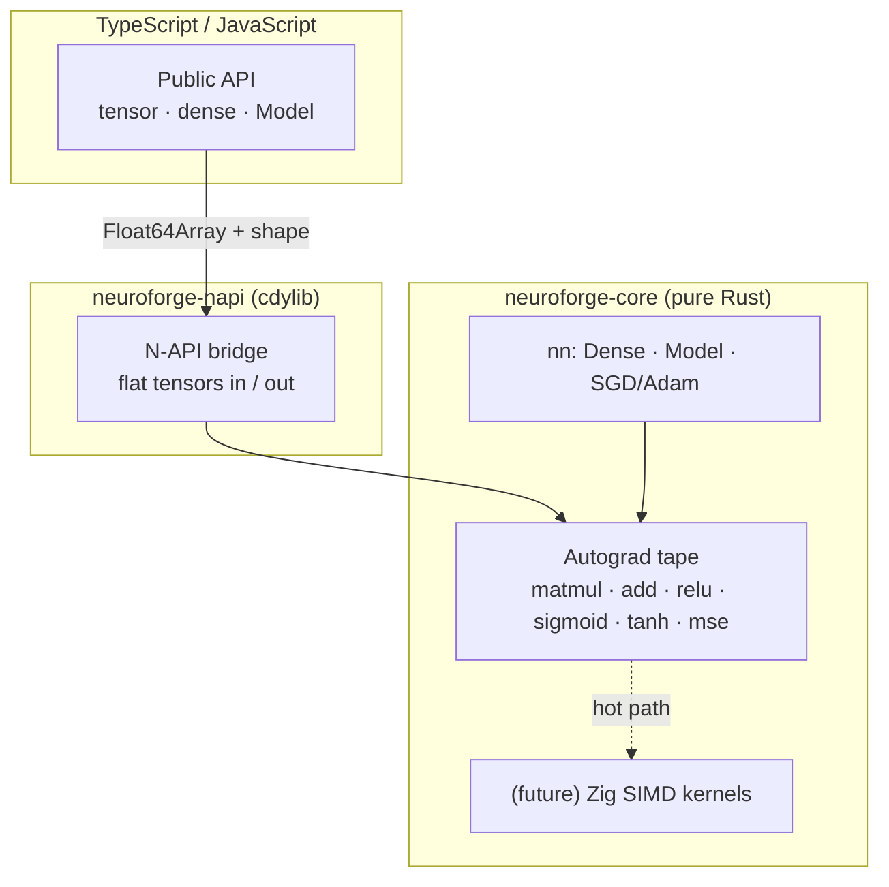

<div align="center">


**A high-performance Deep Learning framework with a Rust core, native to the Node.js ecosystem.**

*Forge your own neural networks — no Python, no C/C++ toolchain, no heavyweight runtime.*

<br/>

[](https://www.npmjs.com/package/intellivium)
[](https://www.rust-lang.org/)
[](https://nodejs.org/)
[](https://napi.rs/)
[](#-license)

**English** · [Español](./README.es.md)

</div>

---

## Overview

**Intellivium** is a deep learning framework whose numerical core is written entirely in **Rust** and exposed to JavaScript/TypeScript through **N-API**. The goal is the power of a native ML engine with the ergonomics of the npm ecosystem: `npm install`, import, and train — with precompiled binaries per platform and **no C/C++ source, no Python, and no embedded VM**.

It draws inspiration from PyTorch, TensorFlow and Flux.jl, but makes a deliberate engineering choice: **one native language (Rust)** for the engine, **TypeScript** for the public API, and **Zig** reserved strictly for future hot kernels.

> **Why not Julia / C++?** Julia can be embedded, but it drags its full runtime (VM + LLVM + stdlib, hundreds of MB) plus JIT warm-up — impractical to ship over npm. C++ is unnecessary: Rust delivers the same low-level control and SIMD without the toolchain pain. See [Architecture](#architecture).

---

## ✨ Why Intellivium

| | |
|---|---|
| 🦀 **Rust core** | Memory-safe, fast, with a tape-based reverse-mode autograd engine built from scratch. |
| 📦 **Node-native** | Ships as prebuilt N-API binaries: `npm install` and go — no compiler required by users. |
| 🧩 **Modular** | Clean separation: engine (`neuroforge-core`) ↔ bindings (`neuroforge-napi`) ↔ API (`ts/`). |
| 🪶 **Zero heavyweight deps** | No Python interpreter, no Julia runtime, no libtorch. The whole engine is one native addon. |
| 🔓 **TypeScript-first API** | Fully typed, ergonomic surface that reads like modern JS. |
| ⚙️ **Zig-ready** | Architecture leaves a clean hook for Zig SIMD kernels when profiling demands it. |

---

## 🚦 Project Status

> **v0.2.0 · on npm.** The engine is tested and trains real models. It's still pre-1.0, so the API may evolve — and the grand vision further down is a roadmap, not a current claim.

**Available today** ✅
- Reverse-mode automatic differentiation (Wengert tape, no `Rc<RefCell>`).
- Ops: `matmul`, broadcasted bias `add`, `relu`, `sigmoid`, `tanh`, `MSE`.
- `Dense` layers with He initialization, sequential `Model`, **SGD & Adam** optimizers, **MSE & BCE** losses.
- N-API bindings + typed TypeScript API.
- Validated end-to-end on the XOR problem (non-linear): **loss 0.247 → 0.0002**.

---

## 🚀 Quickstart

```bash
npm install intellivium
```

```ts
import { tensor, dense, Model } from "intellivium";

// XOR — the classic non-linear sanity check
const X = tensor([[0, 0], [0, 1], [1, 0], [1, 1]]);
const y = tensor([[0],    [1],    [1],    [0]]);

const model = new Model([
  dense(2, 8, "tanh"),
  dense(8, 1, "sigmoid"),
]);

const history = await model.train(X, y, {
  epochs: 1500,
  lr: 0.05,
  optimizer: "adam",
  loss: "bce",
});
console.log("final loss:", history.at(-1));

const pred = model.predict(X);
console.log(pred.toArray()); // ≈ [[0], [1], [1], [0]]
```

---

## Architecture

The autograd graph lives **entirely in Rust**. Only flat tensors (`Float64Array` + shape) and high-level operations cross the FFI boundary — the graph is never marshalled per-op.



**Layout**

```
Intellivium/
├── crates/
│   ├── neuroforge-core/    # pure-Rust engine: autograd + nn  ← works today
│   │   ├── src/tape.rs     #   reverse-mode AD (the heart)
│   │   ├── src/nn.rs       #   Dense, Model, train/predict
│   │   └── examples/xor.rs #   `cargo run` proof
│   └── neuroforge-napi/    # N-API bindings → .node
├── ts/                     # public TypeScript API
├── examples/               # xor.mjs (Node)
└── NEUROFORGE_BUILD.md      # stack decision + build guide
```

---

## 🔧 Build from source

**Requirements:** [Rust](https://rustup.rs/) (rustup), Node.js 18+, and `@napi-rs/cli` (already a dev dependency).

```bash
# 1. test the Rust engine alone (no Node needed)
cargo run --release -p neuroforge-core --example xor

# 2. build everything (native .node + TypeScript)
npm install
npm run build

# 3. run the Node example
npm test
```

---

## 🗺️ Roadmap & Vision

The engine is the foundation. The framework grows from here.

**Next**
- [x] Adam optimizer
- [x] BCE / Cross-Entropy losses
- [ ] Mini-batch training & data loaders
- [ ] Model `save` / `load` (weights serialization)

**Then**
- [ ] Conv / Pooling layers
- [ ] RNN · LSTM · GRU
- [ ] Zig SIMD kernels for matmul / conv hot paths

**Vision** *(not yet implemented)*
- [ ] Transformers & modern attention
- [ ] Autoencoders · GAN · VAE
- [ ] Reinforcement learning (Q-learning, PPO, SAC)
- [ ] **ForgeLab** — scientific computing submodule (linear algebra, numerical methods)
- [ ] **HDE** — Hyper-Data Engine (lazy loading, columnar, hot-caching)
- [ ] GPU acceleration

---

## 🤝 Contributing

Issues, ideas and pull requests are welcome. For substantial changes, open an issue first to discuss direction. Please keep the engine (`neuroforge-core`) free of binding/runtime concerns — that separation is intentional.

---

## ⚠️ License

**[Apache License 2.0](./LICENSE).** You may use, modify, and distribute this software under the terms of the Apache 2.0 license, including a patent grant. Copyright © 2026 Brashkie.

---

<div align="center">

⭐ **If Intellivium is useful to you, consider starring the repo.**

Built by [Brashkie](https://github.com/Brashkie)

</div>
