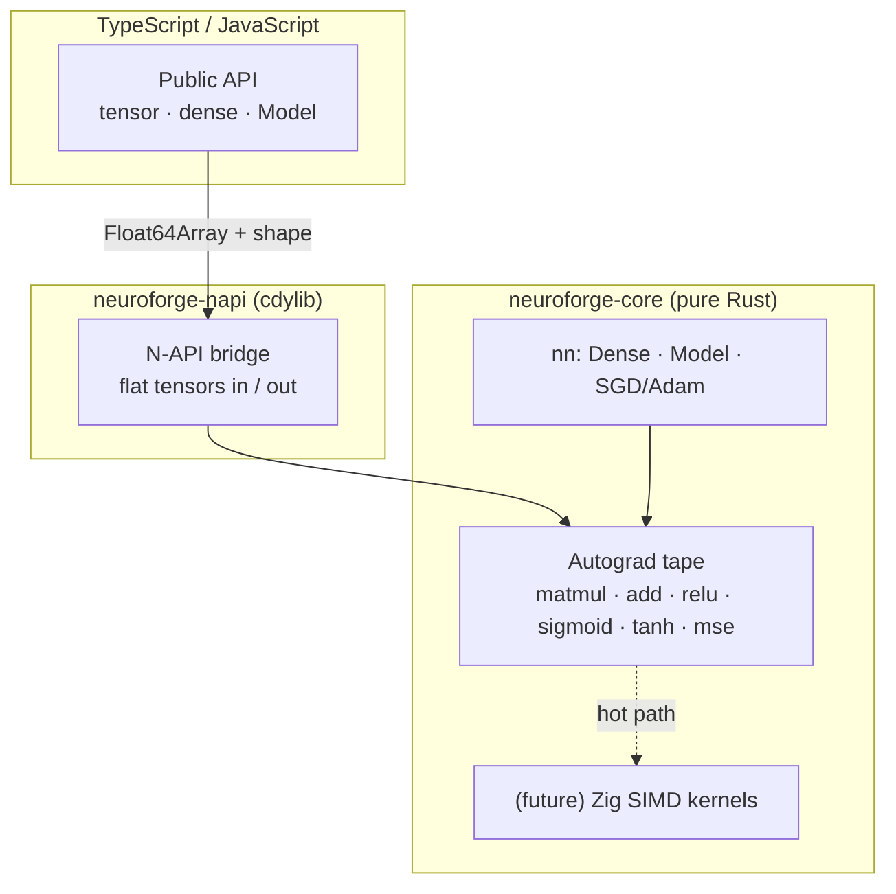

<div align="center">


**A high-performance Deep Learning framework with a Rust core, native to the Node.js ecosystem.**

*Forge your own neural networks — no Python, no C/C++ toolchain, no heavyweight runtime.*

<br/>

[](https://www.npmjs.com/package/intellivium)
[](https://www.rust-lang.org/)
[](https://nodejs.org/)
[](https://napi.rs/)
[](#-license)

**English** · [Español](./README.es.md)

</div>

---

## Overview

**Intellivium** *(formerly NeuroForge)* is a deep learning framework whose numerical core is written entirely in **Rust** and exposed to JavaScript/TypeScript through **N-API**. The goal is the power of a native ML engine with the ergonomics of the npm ecosystem: `npm install`, import, and train — with precompiled binaries per platform and **no C/C++ source, no Python, and no embedded VM**.

It draws inspiration from PyTorch, TensorFlow and Flux.jl, but makes a deliberate engineering choice: **one native language (Rust)** for the engine, **TypeScript** for the public API, and **Zig** reserved strictly for future hot kernels.

> **Why not Julia / C++?** Julia can be embedded, but it drags its full runtime (VM + LLVM + stdlib, hundreds of MB) plus JIT warm-up — impractical to ship over npm. C++ is unnecessary: Rust delivers the same low-level control and SIMD without the toolchain pain. See [Architecture](#architecture).

---

## ✨ Why Intellivium

| | |
|---|---|
| 🦀 **Rust core** | Memory-safe, fast, with a tape-based reverse-mode autograd engine built from scratch. |
| 📦 **Node-native** | Ships as prebuilt N-API binaries: `npm install` and go — no compiler required by users. |
| 🧩 **Modular** | Clean separation: engine (`neuroforge-core`) ↔ bindings (`neuroforge-napi`) ↔ API (`ts/`). |
| 🪶 **Zero heavyweight deps** | No Python interpreter, no Julia runtime, no libtorch. The whole engine is one native addon. |
| 🔓 **TypeScript-first API** | Fully typed, ergonomic surface that reads like modern JS. |
| ⚙️ **Zig-ready** | Architecture leaves a clean hook for Zig SIMD kernels when profiling demands it. |

---

## 🚦 Project Status

> **v0.5.0 · on npm.** The engine is tested and trains real models. It's still pre-1.0, so the API may evolve — and the grand vision further down is a roadmap, not a current claim.

**Available today** ✅
- Reverse-mode automatic differentiation (Wengert tape, no `Rc<RefCell>`).
- Ops: `matmul`, broadcasted bias `add`, `relu`, `sigmoid`, `tanh`, `MSE`.
- `Dense` layers with He init, sequential `Model`, **SGD & Adam** optimizers, **MSE / BCE / categorical cross-entropy** losses, **softmax** for **multi-class** output, **mini-batch** training with `Dataset`/`DataLoader`, **validation + early stopping + checkpoints**, **gradient clipping**, **LR decay**, and model **`save`/`load`**.
- N-API bindings + typed TypeScript API.
- Validated end-to-end on the XOR problem (non-linear): **loss 0.247 → 0.0002**.

---

## 🚀 Quickstart

```bash
npm install intellivium
```

```ts
import { tensor, dense, Model } from "intellivium";

// XOR — the classic non-linear sanity check
const X = tensor([[0, 0], [0, 1], [1, 0], [1, 1]]);
const y = tensor([[0],    [1],    [1],    [0]]);

const model = new Model([
  dense(2, 8, "tanh"),
  dense(8, 1, "sigmoid"),
]);

const history = await model.train(X, y, {
  epochs: 1500,
  lr: 0.05,
  optimizer: "adam",
  loss: "bce",
});
console.log("final loss:", history.at(-1));

const pred = model.predict(X);
console.log(pred.toArray()); // ≈ [[0], [1], [1], [0]]
```

---

## Architecture

The autograd graph lives **entirely in Rust**. Only flat tensors (`Float64Array` + shape) and high-level operations cross the FFI boundary — the graph is never marshalled per-op.



**Layout**

```
Intellivium/
├── crates/
│   ├── neuroforge-core/    # pure-Rust engine: autograd + nn  ← works today
│   │   ├── src/tape.rs     #   reverse-mode AD (the heart)
│   │   ├── src/nn.rs       #   Dense, Model, train/predict
│   │   └── examples/xor.rs #   `cargo run` proof
│   └── neuroforge-napi/    # N-API bindings → .node
├── src/                    # public TypeScript API
└── examples/               # xor.mjs (Node)
```

---

## 🔧 Build from source

**Requirements:** [Rust](https://rustup.rs/) (rustup), Node.js 18+, and `@napi-rs/cli` (already a dev dependency).

```bash
# 1. test the Rust engine alone (no Node needed)
cargo run --release -p neuroforge-core --example xor

# 2. build everything (native .node + TypeScript)
npm install
npm run build

# 3. run the Node example
npm test
```

---

## 🗺️ Roadmap & Vision

The engine is the foundation. Everything below is the long-term plan, phase by phase — honest about what already ships versus what's still ahead.

**Legend:** ✅ Complete · 🟡 Partial · 🔴 Planned

### Phase 1 — Deep Learning Core · 🟡
*A stable, reliable engine.*

**Tensors**
- [ ] Data types (dtype system — currently f32 only)
- [x] Broadcasting
- [x] Basic operations
- [x] MatMul
- [x] Shape checking
- [ ] Tensor views

**Autograd**
- [x] Reverse mode
- [x] Wengert tape
- [x] Gradients
- [x] Computation graph
- [x] Automatic graph release

**Neural networks**
- [x] Dense
- [x] Sequential
- [x] He initialization
- [x] ReLU
- [x] Sigmoid
- [x] Tanh
- [x] Softmax

**Loss functions**
- [x] MSE
- [x] BCE
- [x] Cross-Entropy (categorical)

**Optimizers**
- [x] SGD
- [x] Adam

**API**
- [x] TypeScript
- [x] N-API
- [x] npm

### Phase 2 — Training · 🟡 (nearly complete)
*Make training a model comfortable.*

**Dataset**
- [x] Dataset
- [x] TensorDataset
- [ ] Custom Dataset

**DataLoader**
- [x] Mini-batch
- [x] Shuffle
- [x] Batch iterator

**Training loop**
- [x] Validation
- [x] Early stopping
- [x] Checkpoints
- [x] Gradient clipping
- [x] Learning-rate scheduler

**Serialization**
- [x] save()
- [x] load()
- [ ] exportWeights()
- [ ] importWeights()

### Phase 3 — Neural Library · 🔴
*More building blocks.*

**Layers**
- [ ] Dropout
- [ ] BatchNorm
- [ ] LayerNorm
- [ ] Embedding
- [ ] Flatten
- [ ] Reshape

**CNN**
- [ ] Conv1D
- [ ] Conv2D
- [ ] Conv3D

**Pooling**
- [ ] MaxPool
- [ ] AvgPool
- [ ] Global pool

**Recurrent**
- [ ] RNN
- [ ] LSTM
- [ ] GRU

### Phase 4 — Engine Optimization · 🔴
*Before adding modern AI.*

**SIMD**
- [ ] Zig SIMD
- [ ] Optimized MatMul
- [ ] Optimized Conv

**Memory**
- [ ] Arena allocator
- [ ] Buffer pool
- [ ] Zero copy
- [ ] Tensor pool

**Parallelism**
- [ ] Rayon
- [ ] Multi-thread

**Benchmark**
- [ ] Benchmarks
- [ ] Profiler

### Phase 5 — Modern Architectures · 🔴
*Where Transformers finally appear.*

**Attention**
- [ ] Self-attention
- [ ] Multi-head attention
- [ ] Positional encoding
- [ ] Rotary embeddings

**Transformers**
- [ ] Encoder
- [ ] Decoder
- [ ] GPT
- [ ] BERT

**Vision**
- [ ] Vision Transformer
- [ ] ConvNeXt

### Phase 6 — Generative Models · 🔴
- [ ] Autoencoder
- [ ] VAE
- [ ] GAN
- [ ] Diffusion

### Phase 7 — Reinforcement Learning · 🔴
- [ ] Replay buffer
- [ ] DQN
- [ ] PPO
- [ ] SAC
- [ ] Actor-Critic

### Phase 8 — ForgeLab · 🔴
*Scientific computing.*

**Linear algebra**
- [ ] LU
- [ ] QR
- [ ] SVD
- [ ] Eigen

**Numerical**
- [ ] Optimization
- [ ] ODE
- [ ] Root finding

**Statistics**
- [ ] Monte Carlo
- [ ] Distributions

### Phase 9 — Hyper-Data Engine (HDE) · 🔴

**Data**
- [ ] Lazy loading
- [ ] Streaming
- [ ] Hot cache
- [ ] Dataset cache

**Formats**
- [ ] Parquet
- [ ] Arrow
- [ ] CSV
- [ ] JSON

**Engine**
- [ ] Memory mapping
- [ ] Prefetch
- [ ] Columnar storage

### Phase 10 — GPU · 🔴

**GPU**
- [ ] CUDA
- [ ] ROCm
- [ ] Metal
- [ ] Vulkan

**Mixed precision**
- [ ] FP16
- [ ] BF16

**Quantization**
- [ ] INT8
- [ ] INT4

### Phase 11 — Production · 🔴
- [ ] Inference engine
- [ ] Batch inference
- [ ] ONNX
- [ ] Serving
- [ ] HTTP
- [ ] gRPC

### Phase 12 — Ecosystem · 🔴
*Tooling, not AI.*

**Visualization**
- [ ] Dashboard
- [ ] Tensor inspector
- [ ] Training graphs

**Extensions**
- [ ] Plugins
- [ ] Custom layers
- [ ] Custom optimizers

**Model Hub**
- [ ] Models
- [ ] Datasets

### Phase 13 — Research · 🔴
*The most ambitious vision.*

**Distributed**
- [ ] Multi-GPU
- [ ] Multi-node

**Compiler**
- [ ] Graph optimizer
- [ ] Kernel fusion

**AutoML**
- [ ] NAS
- [ ] Hyperparameter search

## 🤝 Contributing

Issues, ideas and pull requests are welcome. For substantial changes, open an issue first to discuss direction. Please keep the engine (`neuroforge-core`) free of binding/runtime concerns — that separation is intentional.

---

## ⚠️ License

**[Apache License 2.0](./LICENSE).** You may use, modify, and distribute this software under the terms of the Apache 2.0 license, including a patent grant. Copyright © 2026 Brashkie.

---

<div align="center">

⭐ **If Intellivium is useful to you, consider starring the repo.**

Built by [Brashkie](https://github.com/Brashkie)

</div>
